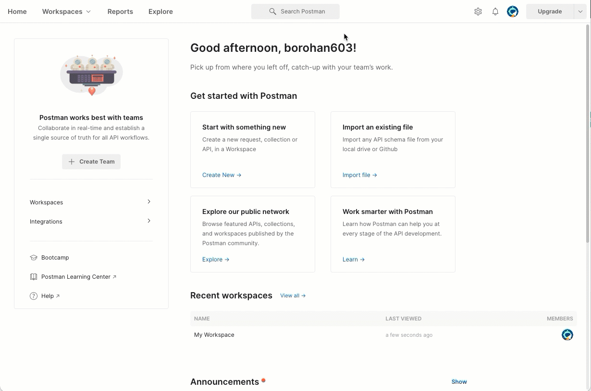

# Pave Postman Public Workspace & Collection

If you're looking for a quick and easy way to get started with the Pave API with no
additional code, then you're in the right place. [Postman](https://www.postman.com/) is
a great tool to create, share and test API functionality without having to write any
code. This quick start guide will walk you through how to get up and running with the
Pave API. Please refer to the [API documentation](https://developers.pave.dev) if
you're looking for a more in depth guide of the API.

## Collection

Our collection of example Pave API requests is available under our Pave Financial Postman Public Workspace:
* At this URL: [https://www.postman.com/paveapi/workspace/pave-financial-public-workspace](https://www.postman.com/paveapi/workspace/pave-financial-public-workspace)
* Or by searching directly in Postman for "Pave Financial Public Workspace"

## Getting Started

1. Get your API Keys from Pave.

2. Download and install [Postman](https://www.postman.com/downloads/).

3. Follow the [*Pave Financial Public Workspace* link]((https://www.postman.com/paveapi/workspace/pave-financial-public-workspace))
   , or search for it directly in Postman.

4. Right-click on the *Pave Cashflow API* collection, and select *Create a fork*.

5. Add the fork to your own workspace.

6. Configure the `PAVE_API_KEY` variable defined at the collection level. Use the
   `CURRENT VALUE` column to keep your API key secret.
    
7. Save the collection variables.

8. Modify `{{user_id}}` in the request URL wherever required.

9. Hit *Send* button!
