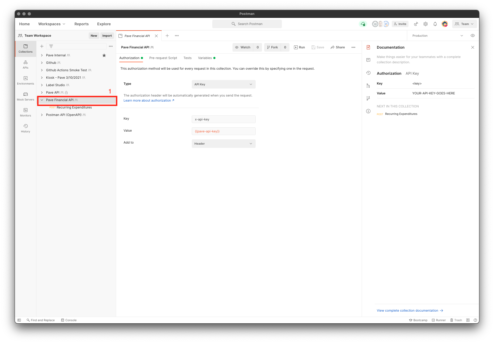

# Pave Postman Collections

If you're looking for a quick and easy way to get started with the Pave API with no additional code, then you're in the right place. [Postman](https://www.postman.com/) is a great tool to create, share and test API functionality without having to write any code. This quick start guide will walk you through how to get up and running with the Pave API. Please refer to the [API documentation](https://pavedev.redoc.ly/) if you're looking for a more in depth guide of the API. 

# Getting Started
1. Get your API Keys from Pave.
2. Download and install [Postman](https://www.postman.com/downloads/).
3. Import the Postman Collection by clicking `File > Import`.
4. Select the `Link` tab and paste the following link:
    ```
      https://raw.githubusercontent.com/Pave-Financial/postman-collections/main/Pave%20Financial%20API.postman_collection.json
    ```
4. Configure the environment variables.

## Configuring the environment Variables

In order to make it easy for you to use the collection, we provide [Postman variables](https://learning.postman.com/docs/sending-requests/managing-environments/).



1. Select the Collection name in the left hand menu.
2. Select the Variables tab.
3. Replace the value of the `pave-api-key` with your actual API key.

# Available endpoints

The following requests are available as pre-filled requests that will allow you to test the Pave API.

- Recurring Expenditures
  - Replace the `user_id` variable in the json body of the request.
  - Press the `Send`, Button
